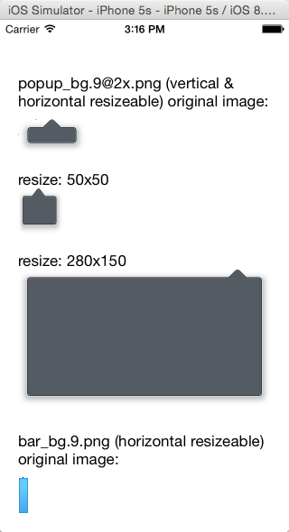
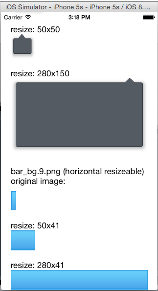
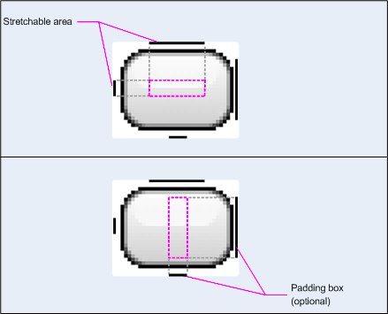

#ALNinePatchImage#

An UIImage category, supports 9-patch resizable image for iOS.

##Example##

##What's 9-patch image##

9.png (9 patch)images are widely used in Android. It helps us to reduce the size of resizeable image.

This is the 9 patch description for Android. most the same as `ALNinePatchImage`, but `ALNinePatchImage` doesn't support the padding box. so we just need the top and left black line to indicat the stretchable area.

**NOTE**: the black line always 1px width for top line and 1px width for left line, no matter what scale the image is.  And the 1px border is the extra data, not including in the size of the real image that would be shown in your UI.

